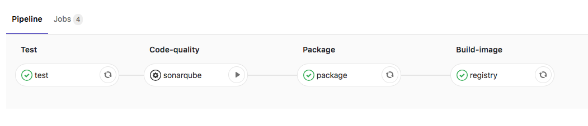

# Pipeline documentation

[Link to pipeline](https://gitlab.com/itinerary-challenge/itinerary-service/pipelines)

## Pipeline steps

- Test: Run all application tests. (Unit and Integration tests)
- Sonar: Check code quality. (It is disabled because there is no sonar server.)
- Package: Build the application and create the jar artifact.
- Registry: Build and registry the docker image on Gilab registry.

## Possible improvements

- Use of maven release plugin to automate the pom version increment.
- Use of docker-maven-plugin (from [spotify](https://github.com/spotify/dockerfile-maven)) to registry the docker image tag with pom version.
- Add a kubernetes deployment. 
